# 📊 Grafo de Dependências DAX — Power BI

Uma solução interativa desenvolvida para mapear a linhagem de dados e dependências de medidas em modelos complexos do Power BI. Este projeto nasceu da necessidade de otimizar a documentação técnica e facilitar auditorias de impacto antes de alterações em medidas críticas.

---

## 📋 Índice

- [Visão Geral](#-visão-geral)
- [Funcionalidades](#-funcionalidades)
- [Tecnologias Utilizadas](#️-tecnologias-utilizadas)
- [Arquitetura do Projeto](#-arquitetura-do-projeto)
- [Requisitos do Sistema](#-requisitos-do-sistema)
- [Instalação](#-instalação)
- [Como Usar](#-como-usar)
- [Estrutura de Dados](#-estrutura-de-dados)
- [Funcionalidades Detalhadas](#-funcionalidades-detalhadas)
- [Customização](#-customização)
- [Solução de Problemas](#-solução-de-problemas)
- [Contribuindo](#-contribuindo)

---

## 🎯 Visão Geral

O **Grafo de Dependências DAX** é uma aplicação web interativa que permite visualizar e analisar a rede de dependências entre medidas, colunas e tabelas em modelos semânticos do Power BI. A ferramenta foi desenvolvida para:

- **Documentação Técnica**: Gerar automaticamente a documentação visual das dependências entre objetos DAX
- **Análise de Impacto**: Identificar quais medidas serão afetadas antes de modificar cálculos críticos
- **Otimização de Modelos**: Detectar medidas órfãs e oportunidades de refatoração
- **Auditoria**: Revisar a complexidade e estrutura de cálculos em modelos grandes

---

## 🚀 Funcionalidades

### Visualização Interativa
- **Grafo Hierárquico**: Visualização organizada das dependências em níveis hierárquicos
- **Navegação Intuitiva**: Pan, zoom e navegação fluida pelo grafo
- **Painel de Detalhes**: Clique em qualquer nó para visualizar a expressão DAX formatada

### Análise e Filtros
- **Filtros por Tipo**: Filtre objetos por tipo (MEASURE, COLUMN, TABLE)
- **Seleção de Raízes**: Escolha medidas específicas para focar a análise
- **Health Check**: Identificação visual de medidas órfãs (sem dependentes)

### Características Técnicas
- **Cores Distintas**: Diferenciação visual por tipo de objeto
- **Limpeza de DAX**: Formatação automática das expressões para melhor legibilidade
- **Suporte Unicode**: Tratamento correto de acentuação e caracteres especiais
- **Exportação**: Download do modelo CSV para facilitar o processo

---

## 🛠️ Tecnologias Utilizadas

### Backend e Processamento
- **Python 3.11+**: Linguagem principal
- **Pandas 2.3.3**: Manipulação e análise de dados tabulares
- **NetworkX 3.6.1**: Algoritmos de grafos e análise de redes

### Frontend e Visualização
- **Streamlit 1.52.2**: Framework para aplicações web interativas
- **Pyvis 0.3.2**: Renderização dinâmica e interativa de grafos
- **Altair 6.0.0**: Visualizações declarativas (dependência)

### Bibliotecas de Suporte
- **openpyxl 3.1.5**: Leitura de arquivos Excel
- **jsonpickle 4.1.1**: Serialização de dados complexos
- **Jinja2 3.1.6**: Template engine para renderização HTML

---

## 📦 Arquitetura do Projeto

### Estrutura de Diretórios

```
gabi/
├── app.py                  # Aplicação principal Streamlit
├── requirements.txt        # Dependências Python
├── README.md              # Documentação (este arquivo)
├── .gitignore             # Arquivos ignorados pelo Git
├── .streamlit/            # Configurações do Streamlit
└── lib/                   # Bibliotecas JavaScript externas
    ├── bindings/          # Bindings para componentes
    ├── tom-select/        # Biblioteca de seleção
    └── vis-9.1.2/         # Biblioteca de visualização de redes
```

### Fluxo de Dados

```mermaid
graph LR
    A[Power BI Desktop] -->|INFO.CALCDEPENDENCY| B[Arquivo CSV/Excel]
    B -->|Upload| C[Streamlit App]
    C -->|Pandas| D[DataFrame]
    D -->|Filtros| E[Grafo NetworkX]
    E -->|Pyvis| F[Renderização HTML]
    F -->|Streamlit Components| G[Interface Web]
    G -->|Interação| H[Painel DAX]
```



### Componentes Principais

#### 1. `app.py` - Aplicação Principal

**Funções Core:**
- `limpar_dax(texto)`: Remove caracteres especiais das expressões DAX
- Configuração de página e CSS personalizado
- Processamento de dados e construção do grafo
- Renderização da interface e componentes interativos

**Seções da Interface:**
1. **Instruções**: Expander com guia de extração de dados
2. **Upload**: Componente de upload de arquivo
3. **Filtros**: Sidebar com controles de seleção
4. **Métricas**: Cards com estatísticas do modelo
5. **Grafo**: Visualização interativa principal
6. **Detalhes**: Lista expansível de objetos DAX

---

## 💻 Requisitos do Sistema

### Software
- **Python**: 3.11 ou superior
- **Power BI Desktop**: Qualquer versão com suporte a INFO.CALCDEPENDENCY()
- **Navegador Web**: Chrome, Firefox, Safari ou Edge (versões recentes)

### Hardware (Recomendado)
- **CPU**: 2+ núcleos
- **RAM**: 4GB mínimo (8GB recomendado para modelos grandes)
- **Espaço em Disco**: 500MB para ambiente virtual e dependências

---

## 🔧 Instalação

### 1. Clone o Repositório

```bash
git clone https://github.com/gabrielavillagran/Dependencias_PBI.git
cd Dependencias_PBI
```

### 2. Crie um Ambiente Virtual

**Windows:**
```bash
python -m venv .venv
.venv\Scripts\activate
```

**macOS/Linux:**
```bash
python -m venv .venv
source .venv/bin/activate
```

### 3. Instale as Dependências

```bash
pip install -r requirements.txt
```

### 4. Execute a Aplicação

```bash
streamlit run app.py
```

A aplicação será aberta automaticamente no navegador em `http://localhost:8501`

---

## 📚 Como Usar

### Passo 1: Extrair Dados do Power BI

1. Abra seu relatório no **Power BI Desktop**
2. Navegue para **Exibição** → **Visualização de Consulta DAX**
3. Execute a seguinte query DAX:

```dax
EVALUATE
VAR Medidas = INFO.MEASURES()
VAR Dependencias = INFO.CALCDEPENDENCY()
RETURN
SELECTCOLUMNS(
    FILTER(Dependencias, [OBJECT_TYPE] = "MEASURE"),
    "Tipo Origem", [REFERENCED_OBJECT_TYPE],
    "Origem", [REFERENCED_OBJECT],
    "Expressão Origem", IF([REFERENCED_OBJECT_TYPE] = "MEASURE", 
        MAXX(FILTER(Medidas, [Name] = [REFERENCED_OBJECT]), [Expression]), 
        BLANK()),
    "Tipo Destino", [OBJECT_TYPE],
    "Destino", [OBJECT],
    "Expressão Destino", MAXX(FILTER(Medidas, [Name] = [OBJECT]), [Expression])
)
```

4. Salve os resultados como **CSV** ou **XLSX**

### Passo 2: Carregar no App

1. Clique em **"Envie o arquivo preenchido"**
2. Selecione o arquivo exportado do Power BI
3. Aguarde o processamento dos dados

### Passo 3: Configurar Filtros

**Sidebar - Filtros:**
1. **Selecionar todos os tipos**: Inclui MEASURE, COLUMN, TABLE
2. **Filtrar Origens por Tipo**: Customize quais tipos de objeto incluir
3. **Medidas Destino (Raízes)**: Selecione as medidas para análise

### Passo 4: Explorar o Grafo

- **Navegação**: Use mouse/trackpad para pan e zoom
- **Visualizar DAX**: Clique em qualquer nó para ver a expressão
- **Legenda**: Cores indicam os tipos de objeto
- **Detalhes**: Role para baixo para ver lista completa de expressões

---

## 📊 Estrutura de Dados

### Formato de Entrada Esperado

O arquivo CSV/Excel deve conter as seguintes colunas:

| Coluna | Tipo | Descrição |
|--------|------|-----------|
| `[Tipo Origem]` | String | Tipo do objeto de origem (MEASURE, COLUMN, TABLE) |
| `[Origem]` | String | Nome do objeto de origem |
| `[Expressão Origem]` | String | Expressão DAX do objeto de origem (se aplicável) |
| `[Tipo Destino]` | String | Tipo do objeto de destino (geralmente MEASURE) |
| `[Destino]` | String | Nome do objeto de destino |
| `[Expressão Destino]` | String | Expressão DAX do objeto de destino |

### Exemplo de Dados

```csv
[Tipo Origem];[Origem];[Expressão Origem];[Tipo Destino];[Destino];[Expressão Destino]
MEASURE;Vendas Totais;SUM(Vendas[Valor]);MEASURE;Crescimento %;"DIVIDE([Vendas Totais] - [Vendas Ano Anterior], [Vendas Ano Anterior])"
COLUMN;Vendas[Valor];;MEASURE;Vendas Totais;SUM(Vendas[Valor])
TABLE;Vendas;;MEASURE;Vendas Totais;SUM(Vendas[Valor])
```

> [!NOTE]
> O separador padrão é ponto-e-vírgula (`;`), mas o app detecta automaticamente outros separadores.

---

## 🎨 Funcionalidades Detalhadas

### 1. Sistema de Cores

As cores são atribuídas automaticamente por tipo de objeto:

- 🟢 **MEASURE** (`#88B995`): Verde suave - Medidas calculadas
- 🔵 **COLUMN** (`#5E9AE9`): Azul - Colunas de tabelas
- 🟠 **TABLE** (`#F4A460`): Laranja - Referências a tabelas
- ⚪ **UNKNOWN** (`#CCCCCC`): Cinza - Objetos não classificados

### 2. Painel de Detalhes DAX

Ao clicar em um nó, um painel lateral aparece com:

- **Título**: Nome do objeto
- **Tipo**: Tipo do objeto (badge)
- **Expressão**: Código DAX formatado com syntax highlighting
- **Botão Fechar**: `×` para fechar o painel

### 3. Métricas do Modelo

Quatro cards exibem estatísticas em tempo real:

1. **Objetos no Modelo**: Total de objetos únicos no arquivo original
2. **Nós no Grafo**: Objetos visíveis após aplicar filtros
3. **Relacionamentos**: Número de arestas (dependências)
4. **Tipos Ativos**: Quantidade de tipos selecionados nos filtros

### 4. Layout Hierárquico

O grafo usa layout hierárquico com:
- **Direção**: Top-down (UD)
- **Separação de Níveis**: 150px
- **Espaçamento de Nós**: 200px
- **Física Desabilitada**: Posicionamento estático para performance

---

## 🎛️ Customização

### Modificar Cores dos Nós

Edite o dicionário `cores` em [`app.py`](file:///c:/Users/ResTIC55/Desktop/Projetos/gabi/app.py#L138):

```python
cores = {
    "MEASURE": "#88B995",   # Verde
    "COLUMN": "#5E9AE9",    # Azul
    "TABLE": "#F4A460",     # Laranja
    "UNKNOWN": "#CCCCCC"    # Cinza
}
```

### Ajustar Layout do Grafo

Modifique as opções do Pyvis em [`app.py`](file:///c:/Users/ResTIC55/Desktop/Projetos/gabi/app.py#L153-L158):

```python
net.set_options(json.dumps({
    "nodes": {"shadow": True},
    "layout": {
        "hierarchical": {
            "enabled": True,
            "direction": "UD",        # UD, DU, LR, RL
            "sortMethod": "directed",
            "levelSeparation": 150,   # Espaçamento vertical
            "nodeSpacing": 200        # Espaçamento horizontal
        }
    },
    "physics": {"enabled": False}
}))
```

### Personalizar CSS

Adicione estilos personalizados no bloco CSS em [`app.py`](file:///c:/Users/ResTIC55/Desktop/Projetos/gabi/app.py#L15-L20):

```python
st.markdown("""
    <style>
        [data-testid="stSidebar"] { 
            min-width: 400px; 
            max-width: 400px; 
        }
        .stMetric { 
            background-color: #f8f9fb; 
            padding: 10px; 
            border-radius: 10px; 
            border: 1px solid #e6e9ef; 
        }
    </style>
""", unsafe_allow_html=True)
```

---

## 🔍 Solução de Problemas

### Problema: Caracteres acentuados não aparecem corretamente

**Solução:**
- O arquivo CSV deve ser salvo com encoding **UTF-8 com BOM**
- No Power BI, ao exportar, certifique-se de usar formato CSV UTF-8
- Use o botão "📥 Baixar Modelo CSV" do app para garantir o formato correto

### Problema: Colunas não encontradas

**Erro:** `Colunas [Origem] ou [Destino] não encontradas no arquivo`

**Solução:**
- Verifique se as colunas têm os nomes exatos (incluindo colchetes)
- Certifique-se de que a query DAX foi executada corretamente
- Baixe o modelo CSV do app e compare com seu arquivo

### Problema: Grafo não aparece

**Solução:**
1. Verifique se selecionou pelo menos uma "Medida Raiz" na sidebar
2. Confirme que há dados válidos nas colunas `[Origem]` e `[Destino]`
3. Tente limpar cache do Streamlit: `Ctrl+Shift+R` no navegador

### Problema: Performance lenta com modelos grandes

**Solução:**
- Limite os tipos de objeto selecionados
- Trabalhe com subconjuntos do modelo (selecione poucas medidas raiz)
- Aumente a RAM disponível para o processo Python
- Considere filtrar os dados antes de carregar no app

### Problema: Erro ao instalar dependências

**Erro:** `ERROR: Could not find a version that satisfies the requirement...`

**Solução:**
```bash
# Atualize pip
python -m pip install --upgrade pip

# Instale wheel
pip install wheel

# Tente novamente
pip install -r requirements.txt
```

---

## 🤝 Contribuindo

Contribuições são bem-vindas! Para contribuir:

1. **Fork** o repositório
2. Crie uma **branch** para sua feature (`git checkout -b feature/MinhaFeature`)
3. **Commit** suas mudanças (`git commit -m 'Adiciona MinhaFeature'`)
4. **Push** para a branch (`git push origin feature/MinhaFeature`)
5. Abra um **Pull Request**

### Guia de Estilo

- Use **PEP 8** para código Python
- Adicione **docstrings** para novas funções
- Mantenha **comentários em português** (padrão do projeto)
- Teste localmente antes de enviar PR

### Roadmap de Funcionalidades

- [ ] Exportação do grafo como imagem (PNG/SVG)
- [ ] Suporte a múltiplos arquivos/modelos
- [ ] Comparação de versões de medidas
- [ ] Análise de complexidade DAX
- [ ] Temas dark/light mode
- [ ] API REST para integração automatizada

---

## 📄 Licença

Este projeto está sob a licença MIT. Veja o arquivo `LICENSE` para mais detalhes.

---

## 👤 Autor

**Gabriela Villagran**

- GitHub: [@gabrielavillagran](https://github.com/gabrielavillagran)
- LinkedIn: [Gabriela Villagran](https://www.linkedin.com/in/gabriela-villagran/)

---

## 🙏 Agradecimentos

- Comunidade Power BI pela inspiração
- Desenvolvedores do Streamlit, NetworkX e Pyvis
- Todos que contribuíram com feedback e sugestões

---

## 📞 Suporte

Para questões, sugestões ou reportar bugs:

- **Issues**: [GitHub Issues](https://github.com/gabrielavillagran/Dependencias_PBI/issues)
- **Discussões**: [GitHub Discussions](https://github.com/gabrielavillagran/Dependencias_PBI/discussions)

---

**Desenvolvido com ❤️ para a comunidade Power BI**
